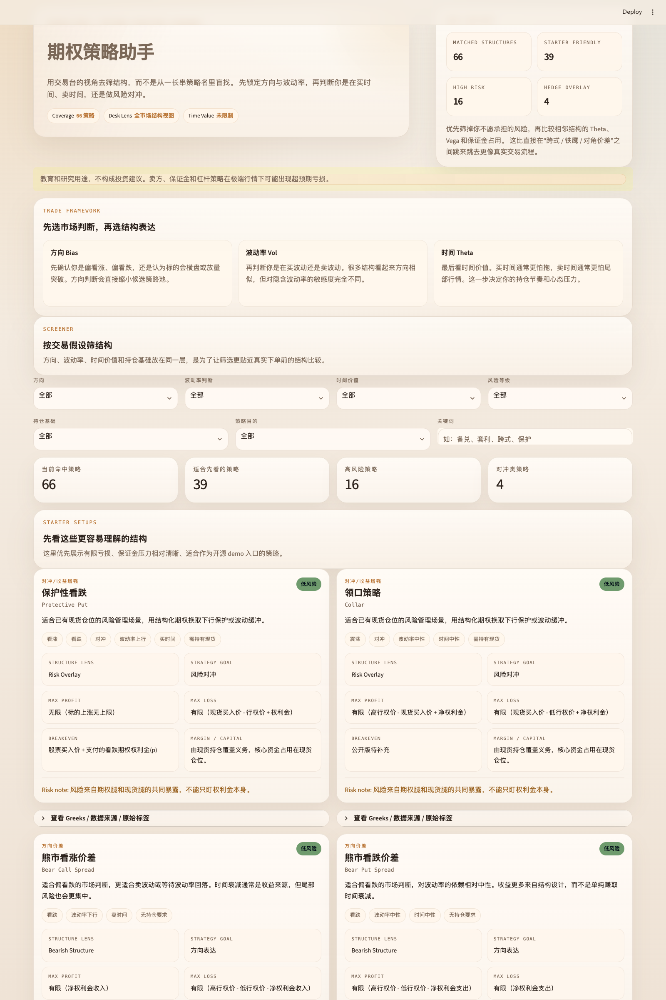

# 期权策略助手

一个面向教育演示、策略初筛和风险沟通的本地期权策略助手。它不是券商下单工具，而是把常见期权策略整理成统一策略库，用更接近交易台的方式帮助使用人理解 `方向 / 波动率 / 时间价值 / 风险承受 / 持仓基础` 之间的关系。



## 为什么这个项目适合开源展示

- 不依赖私有 API、券商账户或实时行情才能运行。
- 仓库内不包含原始电子书或原始表格，公开内容只保留结构化策略元数据与生成脚本。
- 边界明确：教育与研究用途，不输出投资建议，不自动下单。
- 技术栈轻量，别人克隆后即可本地启动和审查代码。

## 当前版本亮点

- 提供一个可直接运行的 `Streamlit` 界面，首页已经做成更适合演示的交易台风格。
- 核心筛选逻辑不是“按策略名字找”，而是按：
  - `方向`：看涨、看跌、震荡、双向波动、对冲、套利
  - `波动率判断`：波动率上行、波动率下行、波动率中性、高波动、定价偏差
  - `时间价值`：买时间、卖时间、时间中性
  - `风险等级`：低风险、中风险、高风险
  - `持仓基础`：无持仓要求、需持有现货、需卖空现货、机构/套利账户
- 每张策略卡片都会突出：
  - 用途和结构定位
  - 最大盈利 / 最大亏损
  - 盈亏平衡
  - 保证金或资金特征
  - Greek 特征和一句话风险提醒
- 提供公开版策略目录 `data/strategy_catalog.json`，无需原始工作簿也能运行 demo。

## 项目结构

- `app.py`: Streamlit 入口
- `src/options_strategy_assistant/catalog.py`: 策略库加载、筛选、展示表格
- `src/options_strategy_assistant/builder.py`: 从本地工作簿生成公开版策略目录
- `scripts/build_strategy_catalog.py`: 生成脚本入口
- `data/strategy_catalog.json`: 可公开分发的种子策略库
- `assets/homepage-trader-warm.png`: 当前首页截图
- `tests/`: 基本单元测试

## 本地启动

```bash
git clone https://github.com/Joyeezy/options-strategy-assistant.git
cd options-strategy-assistant
python3 -m venv .venv
source .venv/bin/activate
pip install -e ".[dev]"
streamlit run app.py
```

如果你在 macOS 上希望直接双击启动，也可以使用项目自带的 `start_options_strategy_assistant.command`。

## 重新生成策略目录

如果你本地有自己的策略表，可以重新生成公开版策略库：

```bash
python scripts/build_strategy_catalog.py --source "/absolute/path/to/期权策略汇总表.xlsx"
```

脚本会：

- 读取本地 `.xlsx`
- 提取策略名、风险等级、Greek 特征、盈亏要点
- 推导出公开界面所需的标签和摘要
- 输出到 `data/strategy_catalog.json`

## 开源边界

- 本仓库不包含原始电子书、原始私有表格或任何受限来源文件。
- `data/strategy_catalog.json` 只保留策略名称、结构化标签和我们生成的简要说明。
- 本项目仅用于学习、研究和界面演示，不构成投资建议。

## 下一步可扩展

- 接入实时期权链和隐含波动率数据
- 加入盈亏图和 Greeks 可视化
- 增加策略对比与组合构建器
- 增加适合散户/机构的分层推荐逻辑
